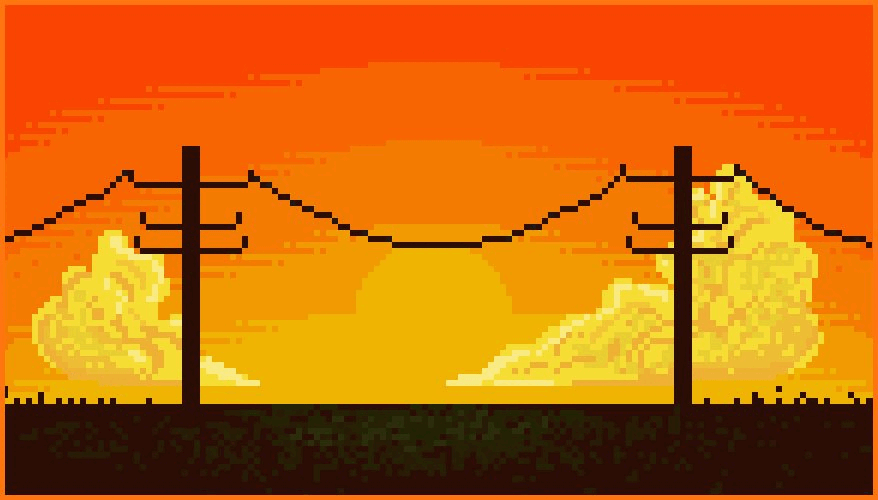
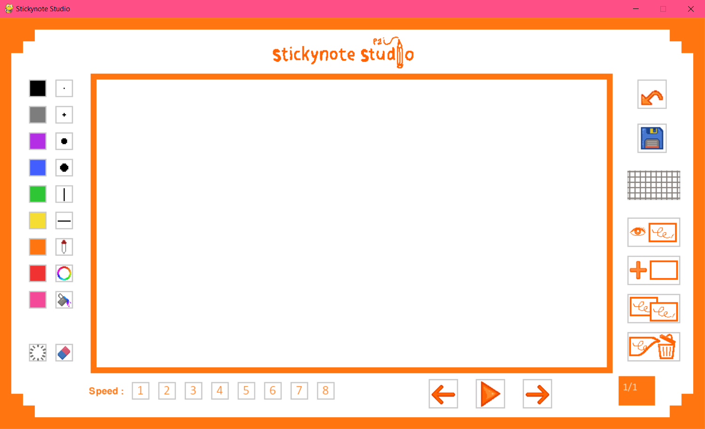

# Stickynote



## What is Stickynote Studio ?

This is a computer science project made with Python for my 2nd year in engineering school at the ENSC. My goal is to create a pixel art application to draw and animate, directly inspired by Flipnote Studio, an application available on the Nintendo DS.

## How do I install and run this project ?

If you only want to run the project, you can download the project executable [on that link](https://drive.google.com/file/d/1TA5sFe7A86OtN9kfzm421x26UZ5aVNVR/view?usp=sharing). After extracting the files, you can run Stickynote Studio by double-clikcing on dist/main.exe.

Few packages are needed to run Sticky. It includes Pygame, Pygame-GUI and OpenCV.
To install these packages, do the following request in a prompt :

```
pip install -r requirements.txt
```

Once it is done, you just have to launch the following file :

```
python main.py
```

Now you are ready to draw like a pro !!

## ...But how do I draw and animate ?

Let me describe the interface in front of you and the tools you can use.



The functionalities available on Stickynote Studio are :
Color choices, represented by squares of the color in question !

-       The different sizes and shapes of brushes
-  The eyedropper (or pipette), to get a color from your canvas
-  The color picker, to choose from an infinite number of color choices
-  The paint pot, to fill an entire cell with the color you want
-  The eraser, which erases the drawing with the selected brush size
-  The clear function, which erases everything on the canva
-  The undo button, represented by a backward arrow, to cancel a drawing
-  The save button, with a floppy disk for saving the video
-  The reference grid, to be activated at your leisure to help you
-  The reference layer of the previous frame, to help you get a coherent and an even smoother animation
-  Adding an animation frame, with the + button
-  Copying a frame, with the two images represented identically
-  The deletion of a frame, where the image is thrown in the trash
- The animation speed choice
-  The button to go back to a previous frame
-  The button to go to a next frame
- And between these 2 buttons, the play button which gives a preview of the animation

You now have all the keys to create your masterpiece.

**So get ready, steady, draw !!**
